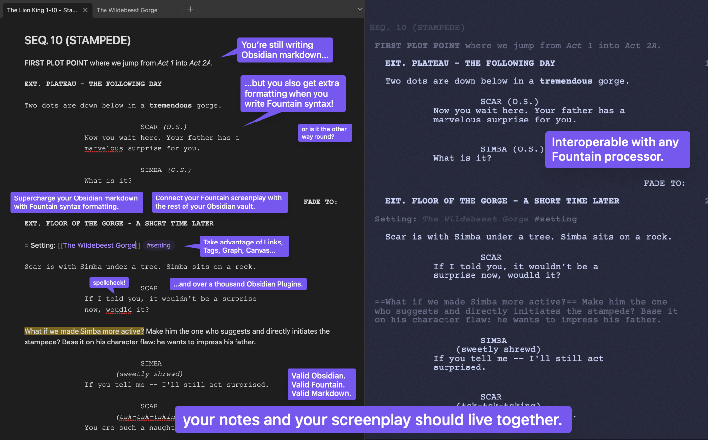

# Obsidian Fountain Editor

‎‎
‎‎

> [!IMPORTANT]
> An [Obsidian](https://obsidian.md) plugin for [Fountain](https://fountain.io) syntax formatting in the editor.

")

> 📺 **Youtube Demo**: [Obsidian Fountain - Live Editor (Plugin Showcase)](https://youtu.be/GORryaw32sI)

 

> [!TIP]
> Full documentation site can be found at obsidian-fountain-editor.chuangcaleb.com. You should check it out.

- [Overview](docs/src/content/docs/start-here/overview.mdx)
- [Contributing](docs/src/content/docs/contributing/index.md)
- [Contact](docs/src/content/docs/contributing/contact.md)
