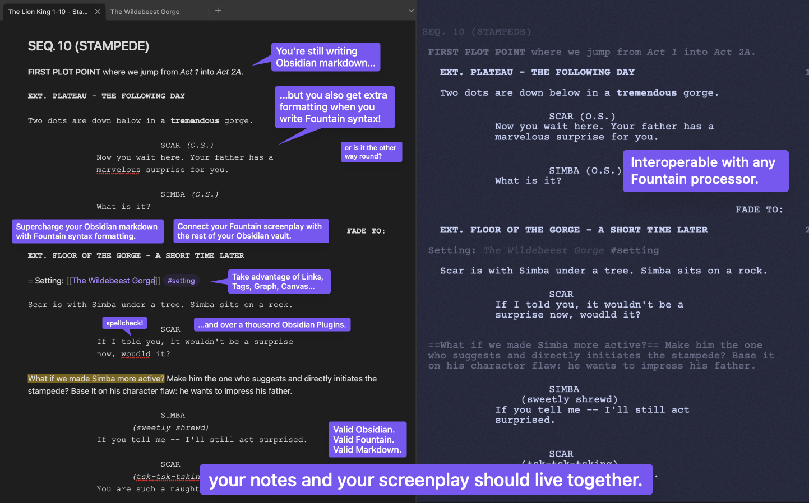

# Fountain Editor - Obsidian Plugin

| **[Obsidian](https://obsidian.md) plugin for [Fountain](https://fountain.io) (screenplay) syntax highlighting in the editor.** |
| :----------------------------------------------------------------------------------------------------------------------------- |

[](https://youtu.be/GORryaw32sI "Obsidian Fountain - Live Editor (Plugin Showcase)")

> 📺 **Youtube Demo**: [Obsidian Fountain - Live Editor (Plugin Showcase)](https://youtu.be/GORryaw32sI)

---

<!--
## FAQ
- What is Obsidian?
- What is Markdown?
- What is Fountain?
- Why this plugin?
-->

## 🔨 Usage

### 🏁 Quickstart

1. 📥 [Click HERE to open the installation page in Obsidian](https://obsidian.md/plugins?id=fountain-editor).
    1. General installation instructions [[Link →]](https://help.obsidian.md/Extending+Obsidian/Community+plugins)
    2. Manual installation [[Link →]](#-manual-installation)
2. 📄 Create a new file and just add `cssclasses: fountain` to the frontmatter metadata Properties.
3. 🎨 You will get **automatic syntax highlighting/styling according to the [Fountain syntax rules](https://fountain.io/syntax/)**!

```yaml
---
cssclasses:
  - fountain
---
# Opening Hook

> THE STINK LINK <

FADE TO:

EXT. PUBLIC RESTROOM - DAY

A POLICE OFFICER steps into a dingy restroom. She winces.

POLICE OFFICER (V.O.)
I *smell* a rat...

= Use Fountain's Synopsis to escape into [[regular markdown]]! #so-cool
```

<!-- DOCS: Where to start -->

### 💿 Manual Installation

1. 🆕 You may install directly with [BRAT](https://github.com/TfTHacker/obsidian42-brat) using the link of this repo (`https://github.com/chuangcaleb/obsidian-fountain-editor`).
2. 📤 You can also go to the repo's [Latest Releases](https://github.com/chuangcaleb/obsidian-fountain-editor/releases/latest/) page and manually download the `obsidian-fountain-editor-[version].zip` file, then extract it into your `.obsidian/plugin` directory!

### 📢 Notice

1. 🎉 We're past functional MVP `v1.0.0`! You may start using this plugin professionally and safely. Just keep in mind that there are still pending optimizations and incomplete features.
2. 🛟 That said, this plugin should only extend your view & should never modify any local files! Worst case scenario if something breaks, just force restart your Obsidian or manually remove this plugin from your `community-plugins.json` list.

---

## 🎯 Goals

| 📍  | <h3>Make Obsidian a _competitive_ option among Fountain writing editors.</h3>                                                                                                                                                                                                                                                                                                                                                                                                           |
| --- | :-------------------------------------------------------------------------------------------------------------------------------------------------------------------------------------------------------------------------------------------------------------------------------------------------------------------------------------------------------------------------------------------------------------------------------------------------------------------------------------- |
| 🔗  | The main selling point is to be able to **connect/link/annotate your helper notes directly with your screenplay**, at the exact location where you referenced it, by allowing Markdown links/tags/extended syntax.                                                                                                                                                                                                                                                                      |
| 🤞  | The 2nd selling point is to **integrate the Fountain screenwriting workflow with all of Obsidian's ecosystem** that fosters _idea-exploration_ and _knowledge-management_ _(Plus, psssst, it's **FREE**)_.                                                                                                                                                                                                                                                                              |
| 🧩  | In a similar vein, certain **Obsidian plugins can add sorely missing features in your Fountain screenplay writing workflow**. The chief missing jigsaw piece that bothers me is that [Fountain requires all your content in a single file](https://github.com/chuangcaleb/ffluent#purpose) — which can get tedious when you have 120+ pages. There's an [Obsidian plugin solution for this](https://github.com/kevboh/longform), and [likely one for any problem](#-synergistic-tools). |
| 🔎  | Competition does not mean lack of cooperation! As explained in our [design principle of scope](/docs/basic/design-guidelines.md#🔬-scoped), **this plugin will try to not do double-work** if possible, and will try to outsource/handover features to other [Synergistic Tools](#-synergistic-tools)!                                                                                                                                                                                  |

---

## ✨ Features

- 🎨 **Get Fountain syntax highlighting** in Editing View (Source mode or Live Preview)!
- ✅ **Specify which individual notes get Fountain styling** with `cssclasses: fountain` in your frontmatter _(opt-in basis, subject to change)_
- 🛁 **Enjoy extended Obsidian syntax** where possible — bring your regular Obsidian markdown, tools, plugins, and workflow!
  - 🧰 **Leverage Obsidian!Markdown**: Use Links, Tags, Embedded Notes / Images / Audio, Graph...
  - 🛏️ **Feel at home**: Fountain's [Section](https://fountain.io/syntax/#sections-synopses) and [Emphasis](https://fountain.io/syntax/#emphasis) syntax don't add new styles — which means they'll look like familiar Obsidian [Headings](https://help.obsidian.md/Editing+and+formatting/Basic+formatting+syntax#Headings) and [inline text styles](https://help.obsidian.md/Editing+and+formatting/Basic+formatting+syntax#Styling+text)!
  - 🪓 **Opt-out** into regular Obsidian!Markdown syntax highlighting with Fountain's [Synopsis](https://fountain.io/syntax/#sections-synopses) token!
- 🤝 **Combine with your favorite Obsidian community plugins** like [Longform](https://github.com/kevboh/longform)!
- 🔧 **Fine-tune** the styling using CSS variables with the format `--fountain--*`... see [base.css](src/styles/base.css) for the exposed CSS variables!

> 📖 See [Design Guidelines](docs/basic/design-guidelines.md) to understand our implementation!

---

## 🤝 Synergistic Tools

- **[kevboh/longform](https://github.com/kevboh/longform): _A plugin for Obsidian that helps you write and edit novels, screenplays, and other long projects._**
- [Better Fountain - Visual Studio Code Extension](https://marketplace.visualstudio.com/items?itemName=piersdeseilligny.betterfountain): _Fountain autocomplete, syntax highlighting, and export to PDF_
- [MeepTech/obsidian-custom-file-extensions-plugin](https://github.com/MeepTech/obsidian-custom-file-extensions-plugin): _An obsidian plugin allowing you to register and view different file extensions in a modular manner._
- [deathau/cm-typewriter-scroll-obsidian](https://github.com/deathau/cm-typewriter-scroll-obsidian): _Typewriter Scroll Obsidian Plugin_

> 📖 Explore [Synergistic Tools](docs/basic/synergistic-tools.md) for details on how they work together with this plugin!

---

## 💝 Contributing

### 👀 Overview

#### 😎 Don't know how to code? You can contribute

- 🪲 **Report bugs** on [the Issue tab](https://github.com/chuangcaleb/obsidian-fountain-editor/issues/new?assignees=&labels=%F0%9F%AA%B2+a/bug&projects=chuangcaleb/2&template=bug_report.md)!
- 📣 **Share ([the link to](https://github.com/chuangcaleb/obsidian-fountain-editor)) this plugin** around on _forums_ and _channels_ and with your _friends_!
  - 🌟 **Star** this repo to receive updates & help raise awareness — if this project has been worth one button click to you!
- 🗣️ **Engage** with others in the [Discussions](https://github.com/chuangcaleb/obsidian-fountain-editor/discussions) tab!
  - 💡 [Pitch an idea](https://github.com/chuangcaleb/obsidian-fountain-editor/discussions/categories/ideas) / feature request!
  - 🙏 [Answer questions](https://github.com/chuangcaleb/obsidian-fountain-editor/discussions/categories/q-a) from the community!
  - 🛠️ [Share tips & tricks](https://github.com/chuangcaleb/obsidian-fountain-editor/discussions/categories/tips-tricks) that have helped you!
  - 🤩 [Send words of encouragement](https://github.com/chuangcaleb/obsidian-fountain-editor/discussions/categories/general) — they actually make a difference to me! :D
  - 👥 All this proves that there's a community of people who are interested!
- ✍🏼 **Create a screenplay project** using this plugin!
  - 📸 **[Showcase your work](https://github.com/chuangcaleb/obsidian-fountain-editor/discussions/categories/showcase)** of how you took advantage of mixing the best of Fountain + Obsidian. Then I can reuse your examples in promotions, and maybe get inspiration for new features too! hehe

#### 🤓 Know how to code? You can contribute too

- 🔀 **Open a Pull Request!** _Focus on critical bugs and priority features first._
- 🪲 **Report a bug** — but with your _specialized technical diagnosis_!
- 🫱 **Send some advice!** Not just a first-time Obsidian plugin dev, but my first public community project.

> 💝 See [Contributing](/contributing.md) for proper technical details!

### 🤙 Contact

The [General - Discussions](https://github.com/chuangcaleb/obsidian-fountain-editor/discussions/categories/general) tab is a neat place you can just tag me in, because you also invite anyone from the community to join in the conversation! It's also better for keeping the context scoped within this project/repo.

If you want a more personal DM'ing (or just to send a private note of thanks!), you can reach me on Discord[#chuangcaleb](https://discordapp.com/users/199882835685801984)! You can also reach out by email to [dev@chuangcaleb.com](mailto:dev@chuangcaleb.com)!

---

## 🔃 Related Projects

- [Darakah/obsidian-fountain](https://github.com/Darakah/obsidian-fountain): _Obsidian plugin to edit, write and render Fountain Writing Syntax for screenplays and scripts_
  - Formats Fountain syntax, just like this plugin
  - But for preview mode only, and must be wrapped in a code block
  - 2.5 years+ old project
- [chuangcaleb/ffluent](https://github.com/chuangcaleb/ffluent): CLI to bundle atomic Fountain screenplay files
  - My attempt to replicate `longform` but for Fountain files, as a CLI.
  - Uses a json/yaml file at each folder directory to configure a custom sequence! So you can have complex folder organization structures
  - Marked as abandoned since this project, but it may be of interest to you!
- [Highland 2](https://www.highland2.app/)
  - Made by the creator of Fountain.
  - Features its own text editor app, WYSIWYG, "Revision Mode" and analysis tools.
  - Since everything is wrapped in a nice bow, it's probably the best Fountain-writing app if you're not technical.
