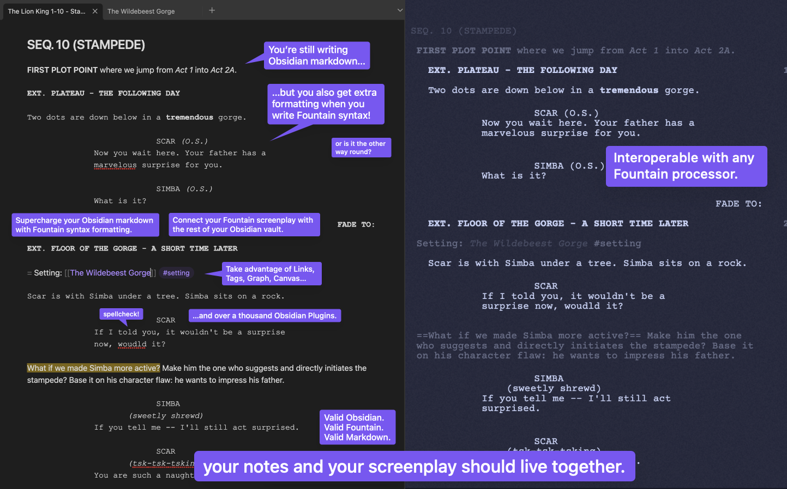

# Obsidian Fountain Editor

An [Obsidian](https://obsidian.md) plugin for [Fountain](https://fountain.io) syntax formatting in the editor.



> 📺 **Youtube Demo**: [Obsidian Fountain - Live Editor (Plugin Showcase)](https://youtu.be/GORryaw32sI)

[](https://community.obsidian.md/plugins/fountain-editor) 

## 🔗 Quicklinks

- [Install](obsidian://show-plugin?id=fountain-editor)
- [Community Page](https://community.obsidian.md/plugins/fountain-editor)
- [Wiki](https://obsidian-fountain-editor.chuangcaleb.com)
  - [Overview](https://obsidian-fountain-editor.chuangcaleb.com/start-here/overview)
  - [Contributing](https://obsidian-fountain-editor.chuangcaleb.com/contributing/)
  - [Contact](https://obsidian-fountain-editor.chuangcaleb.com/contributing/contact/)

## 🔨 Usage

### 🏁 Quickstart

1. 📥 [⭐ Recommended] [Open the installation prompt in Obsidian](obsidian://show-plugin?id=fountain-editor)
   1. [🟢 Beginner] How to install Obsidian plugins [Link →](https://help.obsidian.md/Extending+Obsidian/Community+plugins)
   2. [🔴 Advanced] Manual installation [Link →](#-manual-installation)
2. 📄 [Mark a markdown note for Fountain](/references/marking-fountain) formatting by one of the following:
   1. Use a `.fountain.md` extension
   2. Add a `fountain` tag to the Properties frontmatter
   3. Add `cssclasses: fountain` to the Properties frontmatter
3. 🎨 You will get **automatic syntax highlighting/styling according to the [Fountain syntax](https://fountain.io/syntax/)**!

Try copy-pasting this into a note:

```markdown
---
cssclasses:
  - fountain
---

# Opening Hook

> THE STINK LINK <

FADE TO:

EXT. PUBLIC RESTROOM - DAY

A POLICE OFFICER steps into a dingy restroom. She winces.

POLICE OFFICER (V.O.)
I _smell_ a rat...

= Use Fountain's Synopsis to escape into [[regular markdown]]! #so-cool

%%
You can use **Obsidian comment blocks** to escape into markdown too!

> [!tip] Strip these Obsidian comments out with the Obsidian Longform plugin!

%%
```

## 🧰 Toolset

### Markdown

A lightweight markup syntax that uses simple plaintext formatting for easy conversion other formats.

### Obsidian [↗](https://obsidian.md)

A markdown-based note-taking app with a focus on knowledge management: linking and organizing information.

### Fountain [↗](https://fountain.io)

A lightweight markup syntax for writing screenplays with simple plaintext formatting — just like Markdown.

### Fountain Editor - Obsidian Plugin

This plugin integrates Fountain syntax into Obsidian’s editor!

### Other Plugins & External Tools

Effortlessly incorporate other Obsidian plugins, and external screenplay tools and apps!

### Huh???

You: “I like your funny words, magic man! What are all these different names? I’m new to all this!” [Read more →](https://obsidian-fountain-editor.chuangcaleb.com/start-here/toolset)

## 🌟 Key Features

### 💰 100% Free

No premium tier, no hidden charges. Everything, for $0.

### 📝 Author with Obsidian

One app for your research, references, ideating, outlining, drafting, writing. All linked. Unopinionated workflow.

### 💱 Intuitive Hybrid Syntax

Fountain + Markdown. Interleaved and complementary, with simple design for opt-in and opt-out!

### ⚡ Supercharge with Other Plugins

2k+ Obsidian plugins to further extend custom functionality and create the perfect writing app just for you.

### 🔧 Fine-Tune Your Styles

Fully exposed CSS Variables, for every syntax token, to tweak to pixel perfection.

> [!TIP]
> Full documentation wiki can be found at [obsidian-fountain-editor.chuangcaleb.com](https://obsidian-fountain-editor.chuangcaleb.com). Check it out!

You may also want to check out the similar [Obsidian Fountain plugin](https://github.com/bgrundmann/obsidian-fountain)!
