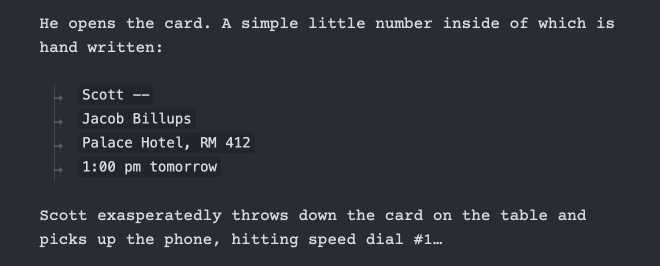

This is a table to compare this plugin's formatting with the full official Fountain syntax.

See [Syntax – Fountain](https://fountain.io/syntax/#emphasis) for the official original Fountain syntax reference, detailed.

### Legend

| Key | Description |
| - | - |
| ✅ | 100% handled, should handle all edge cases |
| ☑️ | Obsidian markdown formatter natively handles it |
| 🚧 | Handled, but has minor issues |
| 📆 | Currently unhandled, low priority, but planned for the future |
| ❌ | Will not be handled |
| 🥊 | Fountain formatting conflicts with native Obsidian formatting |

### Comparison Table

| Fountain Formatting | Status |
| - | - |
| [Scene Heading](https://fountain.io/syntax/#scene-headings) | ✅ |
| Scene Heading (forced) | ✅ |
| Scene Heading → Scene Numbers (see [issue#47](https://github.com/chuangcaleb/obsidian-fountain-editor/issues/47)) | 📆|
|||
| [Action](https://fountain.io/syntax/#action) | ✅ |
| Action (forced) | ✅ |
|||
| [Character](https://fountain.io/syntax/#character) | ✅ |
| Character → Character Extensions | ✅ |
| Character (forced) | ✅ |
|||
| [Dialogue](https://fountain.io/syntax/#dialogue) | ✅ |
|||
| [Parenthetical](https://fountain.io/syntax/#parenthetical) | ✅ |
|||
| [Dual Dialogue](https://fountain.io/syntax/#dual-dialogue) (see [issue#20](https://github.com/chuangcaleb/obsidian-fountain-editor/issues/20)) | ❌  |
|||
| [Lyrics](https://fountain.io/syntax/#lyrics) | ✅ |
|||
| [Transition](https://fountain.io/syntax/#transition) | ✅ |
| Transition (forced) | ✅ |
|||
| [Centered Text](https://fountain.io/syntax/#centered-text) | ✅, 🥊 |
|||
| [Emphasis](https://fountain.io/syntax/#emphasis) |  |
| Emphasis → Italics | ☑️ |
| Emphasis → Bold | ☑️ |
| Emphasis → Underline | 📆, 🥊 |
|||
| [Title Page](https://fountain.io/syntax/#title-page) | ☑️ |
|||
| [Page Breaks](https://fountain.io/syntax/#page-breaks) (see [issue#11](https://github.com/chuangcaleb/obsidian-fountain-editor/issues/11)) | 📆 |
|||
| [Punctuation](https://fountain.io/syntax/#punctuation) (preservation) | ☑️ |
|||
| [Line Breaks](https://fountain.io/syntax/#line-breaks) | ✅ |
|||
| [Indenting](https://fountain.io/syntax/#indenting) | ❌, 🥊 |
|||
| [Notes](https://fountain.io/syntax/#notes) | ❌, 🥊 |
|||
| [Boneyard](https://fountain.io/syntax/#boneyard) | 🚧 |
|||
| [Sections](https://fountain.io/syntax/#sections-and-synopses) | ☑️ |
|||
| [Synopses](https://fountain.io/syntax/#sections-and-synopses) | ✅ |

## Comments

### 🥊 Syntax Conflicts

There are a few minor cases where there is a conflict between Fountain syntax and Markdown formatting styling. See [Syntax Conflicts](/resources/syntax-conflicts) for more details.

### Indenting is not handled

Obsidian parses indentations as inline code. However, Fountain's indentations are meant to be purely visual and optional, and since this plugin aids the visual live formatting, then manual forced indentation is irrelevant.

There is the use case of indented Action blocks, e.g. in the script, an address on a postcard is to be shown on the screen. However, I think Obsidian's formatting is actually usable, even somewhat aesthetic!

### Unhandled cases are still valid Fountain

Note that while a formatting may not be handled by the plugin, and the styling may be missing or weird — it can still be typed out in plaintext, and external tools can still read it if it is used correctly!

### What's next?

- [Design Guidelines](/resources/design-guidelines) for how this plugin's Fountain-Markdown hybrid syntax was decided.
- [Known Issues](/contributing/known-issues) to see if formatting problems were already reported.
- [Syntax Conflicts](/resources/syntax-conflicts) to understand how conflicts in syntax are handled.
